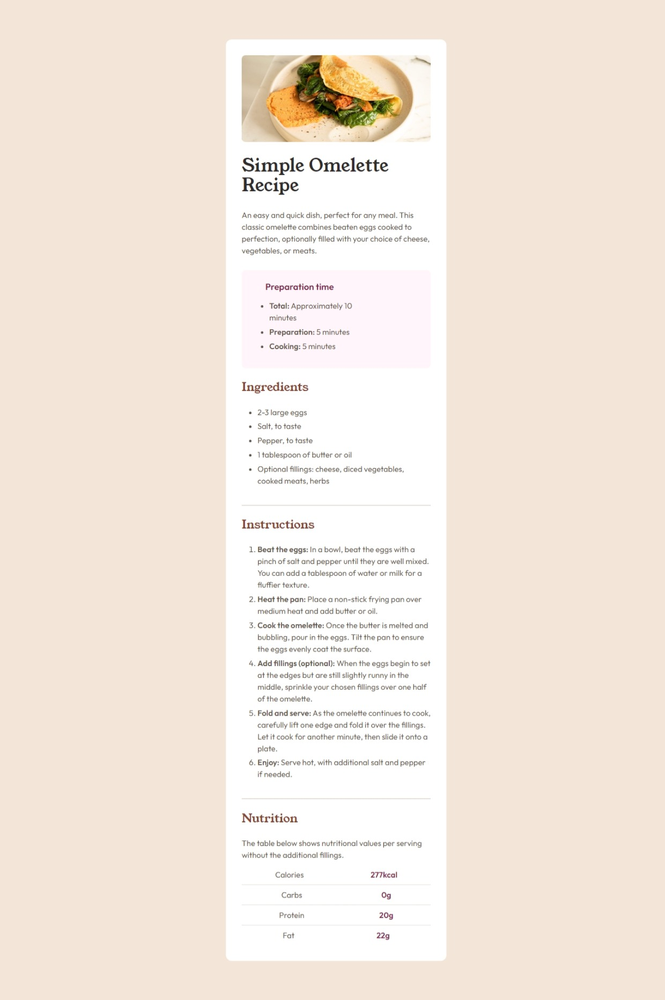
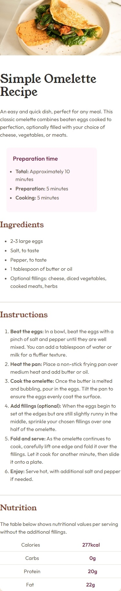

# Frontend Mentor - Recipe page solution

This is a solution to the [Recipe page challenge on Frontend Mentor](https://www.frontendmentor.io/challenges/recipe-page-KiTsR8QQKm). Frontend Mentor challenges help you improve your coding skills by building realistic projects.

## Table of contents

- [Overview](#overview)
  - [Screenshot](#screenshot)
  - [Links](#links)
- [My process](#my-process)
  - [Built with](#built-with)
  - [What I learned](#what-i-learned)
  - [Continued development](#continued-development)
- [Author](#author)
- [Acknowledgments](#acknowledgments)

## Overview

### Screenshot

### Links

- Solution URL: [Solution](https://github.com/Thiagouh/recipe-page-challenge)
- Live Site URL: [Live Site](https://thiagouh.github.io/recipe-page-challenge/)

## My process

### Built with

- Semantic HTML5 markup
- CSS custom properties
- Flexbox
- Mobile-first workflow
- [Tailwind CSS](https://tailwindcss.com/) - For styles

### What I learned

I finally understand how to use @font-face (I believe)! This challenge made me better analyze the use of semantic structure and tags related to it.

### Continued development

I intend to delve deeper into the necessary means and understand them well to solve the proposed challenges. I also intend to use libraries for future challenges.

## Author

- Frontend Mentor - [@Thiagouh](https://www.frontendmentor.io/profile/Thiagouh)

## Acknowledgments

I am grateful in advance to everyone who gives feedback on my project!
